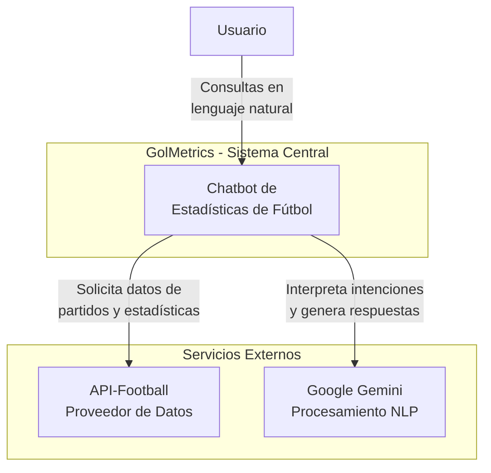
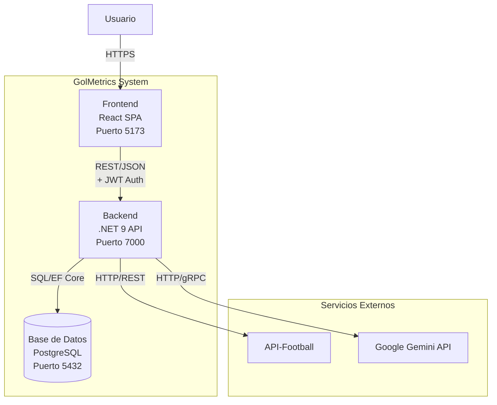
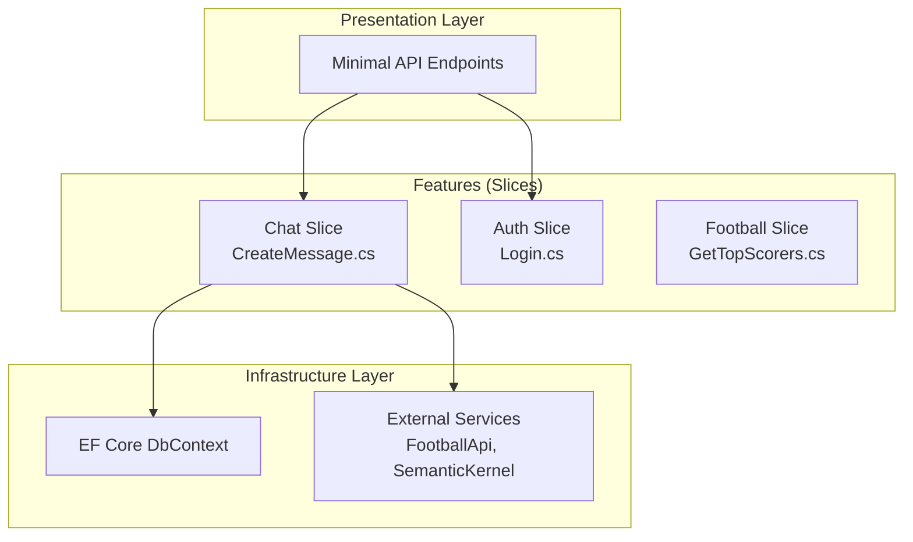
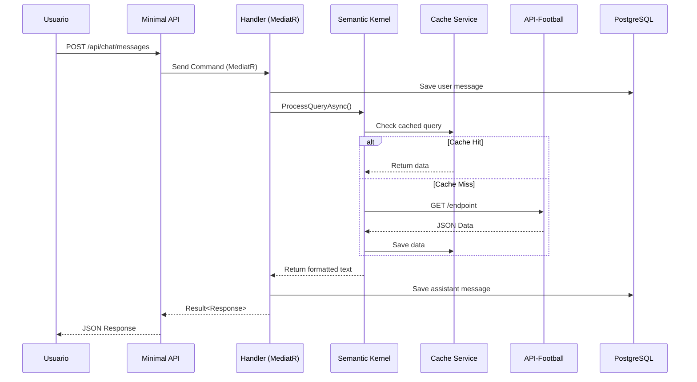

# Architecture - GolMetrics

## 1. Visión Arquitectónica

### 1.1. Principios de Diseño

1. **Simplicidad sobre sofisticación:** MVP funcional > arquitectura perfecta
2. **Vertical Slices:** Features autónomas, fáciles de entender y modificar
3. **Separation of Concerns:** Core compartido solo para entidades base, lógica en features
4. **Testabilidad:** Cada slice testable de forma independiente
5. **Escalabilidad incremental:** Arquitectura que permita crecer sin refactoring masivo

### 1.2. Estilo Arquitectónico

**Arquitectura Vertical Híbrida** = Vertical Slice Architecture + elementos de Clean Architecture

**Razones de la decisión:**

-   **VSA:** Alta cohesión (todo de una feature en un archivo), bajo acoplamiento entre features
-   **Clean Architecture:** Evita duplicación de entidades base y abstracciones comunes
-   **Monolito modular:** Simplifica despliegue sin sacrificar modularidad

---

## 2. Diagrama C4 - Nivel 1: Contexto



**Descripción:**

-   **Usuario:** Interactúa con el sistema mediante preguntas en lenguaje natural.
-   **GolMetrics:** Sistema central que orquesta la interpretación de consultas y obtención de datos.
-   **API-Football:** Proveedor externo de estadísticas de fútbol (ligas, equipos, jugadores).
-   **Google Gemini:** Modelo de lenguaje para interpretar intenciones y formatear respuestas.

---

## 3. Diagrama C4 - Nivel 2: Contenedores



---

## 4. Diagrama C4 - Nivel 3: Componentes (Backend)



---

## 5. Estructura de Proyecto Detallada

Esta estructura replica el estándar del proyecto de referencia, adaptada al dominio de GolMetrics.

```
/src/GolMetrics.Api
│
├── Constants
│   ├── EndpointNames.cs
│   └── CustomMediaTypeNames.cs
│
├── Core
│   ├── Application
│   │   ├── Authorization
│   │   │   └── Permissions.cs
│   │   ├── DTOs
│   │   │   └── Chat / User / Football
│   │   ├── Models
│   │   │   └── PaginationResult.cs
│   │   └── Services
│   │       ├── Auth
│   │       │   └── ICurrentUserService.cs
│   │       └── AI
│   │           └── ISemanticKernelService.cs
│   │
│   └── Domain
│       ├── Abstractions
│       │   ├── Error.cs
│       │   └── Result.cs
│       └── Entities
│           ├── User.cs
│           ├── Conversation.cs
│           ├── Message.cs
│           └── CachedQuery.cs
│
├── Extensions
│   └── DatabaseExtensions.cs
│
├── Features                           # Vertical Slices
│   ├── Auth
│   │   ├── Login.cs
│   │   └── Register.cs
│   ├── Chat
│   │   ├── SendMessage.cs
│   │   └── GetConversations.cs
│   └── Football
│       └── GetTopScorers.cs
│
├── Infrastructure
│   ├── Persistence
│   │   ├── Configurations
│   │   ├── Migrations
│   │   └── AppDbContext.cs
│   └── Slices
│       └── ISlice.cs                 # Interfaz para registrar endpoints
│
├── Middlewares
│   ├── GlobalExceptionHandler.cs
│   └── ValidationExceptionHandler.cs
│
└── Program.cs
```

---

## 6. Patrón de Vertical Slice (Ejemplo: SendMessage.cs)

Implementación utilizando `ISlice` para auto-registro y `MediatR` estándar.

```csharp
namespace GolMetrics.Api.Features.Chat;

// 1. Clase contenedora que implementa ISlice
internal sealed class SendMessage : ISlice
{
    // 2. Registro del Endpoint (Minimal API)
    public void AddEndpoint(IEndpointRouteBuilder app)
    {
        app.MapPost("api/chat/messages", async (
            Request request,
            ISender sender, // MediatR ISender estándar
            CancellationToken ct) =>
        {
            var command = new Command(request.ConversationId, request.Content);
            var result = await sender.Send(command, ct);

            return result.IsSuccess
                ? Results.Ok(result.Value)
                : Results.BadRequest(result.Error);
        })
        .WithName("SendMessage")
        .RequireAuthorization();
    }

    // 3. DTOs públicos
    public record Request(Guid ConversationId, string Content);
    public record Response(string AssistantMessage, DateTime Timestamp);

    // 4. Command (MediatR)
    internal sealed record Command(Guid ConversationId, string Content)
        : IRequest<Result<Response>>;

    // 5. Validator (FluentValidation)
    public class Validator : AbstractValidator<Command>
    {
        public Validator()
        {
            RuleFor(x => x.Content).NotEmpty().MaximumLength(1000);
        }
    }

    // 6. Handler (MediatR)
    internal sealed class Handler(
        AppDbContext dbContext,
        ISemanticKernelService aiService,
        ICurrentUserService currentUser)
        : IRequestHandler<Command, Result<Response>>
    {
        public async Task<Result<Response>> Handle(Command request, CancellationToken ct)
        {
            var userId = currentUser.UserId;
            // ... Lógica de negocio:
            // 1. Guardar mensaje User
            // 2. Llamar AI Service
            // 3. Guardar mensaje Assistant
            // 4. Return Response
            return Result.Success(new Response("Respuesta IA", DateTime.UtcNow));
        }
    }
}
```

---

## 7. Flujo de Datos (Consulta de Chat)



---

## 8. Decisiones Técnicas Clave

### 8.1. Organización Vertical (Slices)

Adoptamos el patrón de **Vertical Slices** anidadas. Cada archivo en `Features/` contiene todo lo necesario para esa funcionalidad específica (Endpoint, Command, Validator, Handler). Esto maximiza la cohesión y facilita el mantenimiento.

### 8.2. MediatR (Librería Estándar)

A diferencia del proyecto de referencia que usa un mediador personalizado, utilizaremos la librería estándar **MediatR**.

-   **Razones:** Amplio soporte comunitario, integración madura con DI en .NET, y comportamientos de pipeline (Behaviors) fáciles de configurar para validación y logging.
-   **Uso:** Inyectamos `ISender` en los endpoints para despachar los comandos.

### 8.3. ISlice Pattern

Usamos la interfaz `ISlice` para escanear y registrar automáticamente todos los endpoints de la aplicación al inicio (`Program.cs`), manteniendo `Program.cs` limpio y delegando la configuración de rutas a cada feature.

---

## 9. Estrategia de Testing

### 9.1. Pirámide de Testing

```
          /\
         /  \  E2E (5%)
        /____\
       /      \  Integration (25%)
      /________\
     /          \  Unit (70%)
    /____________\
```

### 9.2. Qué Testear

| Tipo            | Qué                           | Herramienta              | Ejemplo                                           |
| --------------- | ----------------------------- | ------------------------ | ------------------------------------------------- |
| **Unit**        | Handlers, Validators, Mappers | xUnit + FluentAssertions | `SendMessage.Handler_Should_SaveUserMessage()`    |
| **Integration** | Repositories, DbContext       | xUnit + Testcontainers   | `CachedQueryRepository_Should_ReturnCachedData()` |
| **E2E**         | Flujo completo                | Playwright/Cypress       | `User_Should_SendMessage_AndReceiveResponse()`    |

---

## 10. Seguridad

### 10.1. Autenticación

-   **JWT con HMAC-SHA256**
-   Claims: `user_id`, `email`, `role` (opcional)
-   Expiración: 7 días (configurable)
-   Middleware: `app.UseAuthentication()`

### 10.2. Almacenamiento de API Keys

```csharp
// Encriptar con AES-256
public class ApiKeyEncryptionService
{
    private readonly byte[] _key; // 32 bytes desde secrets

    public string Encrypt(string plainText)
    {
        using var aes = Aes.Create();
        aes.Key = _key;
        aes.GenerateIV();

        var encryptor = aes.CreateEncryptor(aes.Key, aes.IV);
        // ... encriptación

        return Convert.ToBase64String(encrypted);
    }
}
```

### 10.3. Validación de Entrada

-   FluentValidation en todos los Commands
-   Sanitización de HTML/JS (anti-XSS)
-   Rate limiting (opcional): 100 req/min por usuario

---

**Última actualización:** 2025-12-07
**Versión:** 1.1 (Diagramas corregidos)
