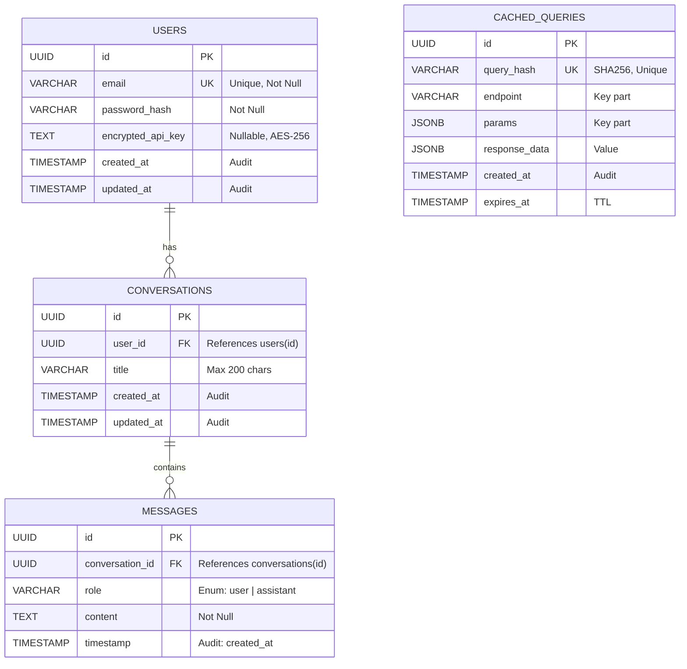

# Data Model - GolMetrics

## 1. Diagrama Entidad-Relación



---

## 2. Descripción de Entidades

### 2.1. USERS

**Propósito:** Gestión de identidad y autenticación

| Campo               | Tipo         | Restricciones                  | Descripción                       |
| ------------------- | ------------ | ------------------------------ | --------------------------------- |
| `id`                | UUID         | PK, Default: gen_random_uuid() | Identificador único               |
| `email`             | VARCHAR(320) | UNIQUE, NOT NULL               | Email de usuario (max RFC 5321)   |
| `password_hash`     | VARCHAR(255) | NOT NULL                       | Hash PBKDF2 (ASP.NET Identity)    |
| `encrypted_api_key` | TEXT         | NULL                           | API Key de API-Football (AES-256) |
| `created_at`        | TIMESTAMP    | NOT NULL, Default: NOW()       | Audit: Fecha de registro          |
| `updated_at`        | TIMESTAMP    | NOT NULL, Default: NOW()       | Audit: Última modificación        |

**Índices:**

```sql
CREATE UNIQUE INDEX idx_users_email ON users(email);
```

---

### 2.2. CONVERSATIONS

**Propósito:** Agrupar mensajes en sesiones de chat

| Campo        | Tipo         | Restricciones            | Descripción                    |
| ------------ | ------------ | ------------------------ | ------------------------------ |
| `id`         | UUID         | PK                       | Identificador único            |
| `user_id`    | UUID         | FK → users(id), NOT NULL | Propietario de la conversación |
| `title`      | VARCHAR(200) | NOT NULL                 | Generado de primera pregunta   |
| `created_at` | TIMESTAMP    | NOT NULL, Default: NOW() | Audit: Inicio de conversación  |
| `updated_at` | TIMESTAMP    | NOT NULL, Default: NOW() | Audit: Última actividad        |

**Índices:**

```sql
CREATE INDEX idx_conversations_user_id ON conversations(user_id);
CREATE INDEX idx_conversations_updated_at ON conversations(updated_at DESC); -- Optimiza listado reciente
```

---

### 2.3. MESSAGES

**Propósito:** Almacenar interacciones individuales del chat

| Campo             | Tipo        | Restricciones                            | Descripción                     |
| ----------------- | ----------- | ---------------------------------------- | ------------------------------- |
| `id`              | UUID        | PK                                       | Identificador único             |
| `conversation_id` | UUID        | FK → conversations(id), NOT NULL         | Conversación a la que pertenece |
| `role`            | VARCHAR(20) | NOT NULL, CHECK IN ('user', 'assistant') | Emisor del mensaje              |
| `content`         | TEXT        | NOT NULL                                 | Contenido del mensaje           |
| `timestamp`       | TIMESTAMP   | NOT NULL, Default: NOW()                 | Audit: Momento del mensaje      |

**Índices:**

```sql
CREATE INDEX idx_messages_conversation_id ON messages(conversation_id);
CREATE INDEX idx_messages_timestamp ON messages(timestamp ASC); -- Orden de lectura
```

---

### 2.4. CACHED_QUERIES

**Propósito:** Optimización de llamadas a API-Football mediante cache (Key-Value Store)
_Nota: Esta tabla funciona como un almacén Clave-Valor estructurado, donde la clave lógica es `query_hash`._

| Campo           | Tipo         | Restricciones    | Descripción                  |
| --------------- | ------------ | ---------------- | ---------------------------- |
| `id`            | UUID         | PK               | Identificador único          |
| `query_hash`    | VARCHAR(64)  | UNIQUE, NOT NULL | SHA-256(endpoint + params)   |
| `endpoint`      | VARCHAR(100) | NOT NULL         | Endpoint de API-Football     |
| `params`        | JSONB        | NOT NULL         | Parámetros de la consulta    |
| `response_data` | JSONB        | NOT NULL         | Respuesta completa de la API |
| `created_at`    | TIMESTAMP    | NOT NULL         | Audit: Momento de cacheo     |
| `expires_at`    | TIMESTAMP    | NOT NULL         | TTL: Fecha de expiración     |

**Índices:**

```sql
CREATE UNIQUE INDEX idx_cached_queries_hash ON cached_queries(query_hash); -- Búsqueda O(1)
CREATE INDEX idx_cached_queries_expires_at ON cached_queries(expires_at); -- Cleanup Jobs
```

---

## 3. Estrategia de Auditoría

Todas las entidades principales (`Users`, `Conversations`) implementan el patrón de auditoría básica:

-   `created_at`: Inmutable, establecido al insertar.
-   `updated_at`: Mutable, actualizado vía Trigger o Aplicación en cada cambio.

Para futuras extensiones (Post-MVP), se recomienda una tabla `AuditLogs` separada para trazar quién hizo qué cambio.

---

**Última actualización:** 2025-10-10
**Versión:** 1.1 (Audit Added)
