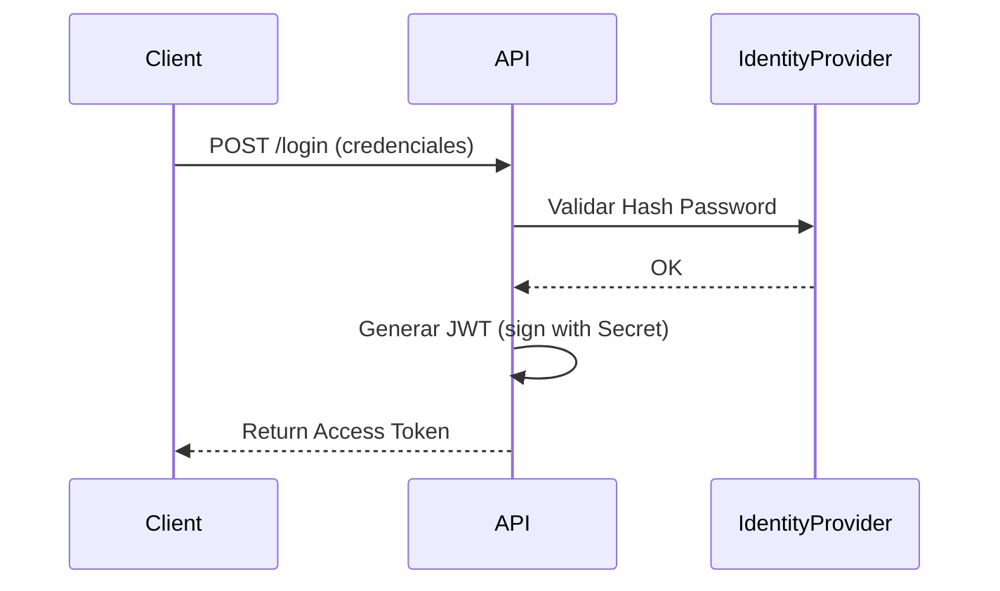

# Security - GolMetrics

## 1. Estrategia de Autenticación y Autorización

### 1.1. Autenticación (Identidad)

La autenticación se basa en el estándar **OpenID Connect / OAuth 2.0** simplificado utilizando **JWT (JSON Web Tokens)**.

**Flujo de Autenticación:**

1.  **Credenciales:** El usuario envía `email` y `password` vía HTTPS.
2.  **Verificación:** El backend valida el hash de la contraseña (usando PBKDF2 o Argon2) contra la base de datos.
3.  **Emisión de Token:** Si es válido, se firma un JWT con `HMAC-SHA256` conteniendo los Claims del usuario.
4.  **Uso:** El cliente (React) envía este token en el header `Authorization: Bearer <token>` en cada petición subsiguiente.

**Diagrama de Secuencia Simplificado:**

### 1.2. Autorización (Permisos)

Se utiliza un modelo **RBAC (Role-Based Access Control)** ligero:

-   **Roles:** `User` (defecto), `Admin`.
-   **Policies:** Definidas en el backend para proteger endpoints específicos (ej. Dashboard de métricas solo para `Admin`).
-   **Validación de Recursos:** Además del rol, se verifica la propiedad del recurso (ej. un usuario solo puede leer _sus_ propias conversaciones).

---

## 2. Protección de Datos Sensibles

### 2.1. Almacenamiento de API Keys (BYOK)

Dado que los usuarios pueden aportar sus propias API Keys de terceros (API-Football), estas se consideran "Secretos de Usuario".

**Estrategia de Cifrado:**

-   **Algoritmo:** AES-256 (Advanced Encryption Standard).
-   **Modo:** CBC (Cipher Block Chaining) o GCM (Galois/Counter Mode) para integridad.
-   **Gestión de Claves:** La clave maestra de cifrado (`MasterKey`) **NUNCA** se almacena en la base de datos. Se inyecta como variable de entorno o secreto de Kubernetes/Azure Key Vault en tiempo de ejecución.

### 2.2. Datos en Tránsito

-   **HTTPS:** Obligatorio para toda comunicación externa.
-   **HSTS:** Habilitado para forzar a los navegadores a usar siempre conexiones seguras.
-   **TLS 1.2+:** Se rechazan conexiones con protocolos obsoletos.

---

## 3. Validación y Sanitización

### 3.1. Entrada (Input Validation)

Se aplica el principio de "Zero Trust" a los datos de entrada:

-   **Validación Estricta:** Se usa `FluentValidation` para asegurar que los DTOs cumplan reglas de negocio (longitud, formato email, caracteres permitidos) _antes_ de llegar al dominio.
-   **Rechazo:** Cualquier entrada malformada resulta en `400 Bad Request` inmediato.

### 3.2. Salida (Output Sanitization)

Para prevenir ataques XSS (Cross-Site Scripting) en el frontend:

-   **Codificación:** Las respuestas de la IA se tratan como texto markdown. Si contienen HTML, este se escapa o sanitiza antes de renderizar.
-   **CSP (Content Security Policy):** Cabeceras HTTP que restringen las fuentes de scripts y estilos permitidos.

---

## 4. Gestión de Vulnerabilidades (OWASP)

| Riesgo                            | Estrategia de Mitigación                                                                                       |
| :-------------------------------- | :------------------------------------------------------------------------------------------------------------- |
| **Inyección (SQL/NoSQL)**         | Uso exclusivo de ORM (EF Core) con consultas parametrizadas. Prohibición de concatenación de strings en SQL.   |
| **Pérdida de Autenticación**      | Rate Limiting en endpoints de login para evitar fuerza bruta. Expiración corta de tokens.                      |
| **Exposición de Datos Sensibles** | Logs estructurados que enmascaran (masking) datos sensibles como passwords o tokens.                           |
| **Componentes Vulnerables**       | Escaneo automatizado de dependencias (NuGet) en el pipeline de CI/CD (ej. `dotnet list package --vulnerable`). |

---

## 5. Gestión de Secretos

La aplicación sigue los principios de **Twelve-Factor App** para la configuración:

1.  **Entorno Local:** Uso de `.NET User Secrets` (almacenamiento fuera del árbol de código) para evitar commits accidentales de credenciales.
2.  **Producción:** Inyección de variables de entorno desde el orquestador (Docker/K8s) o servicios de gestión de secretos (AWS Secrets Manager / Azure Key Vault).

---

**Última actualización:** 2025-10-10
**Versión:** 1.0
