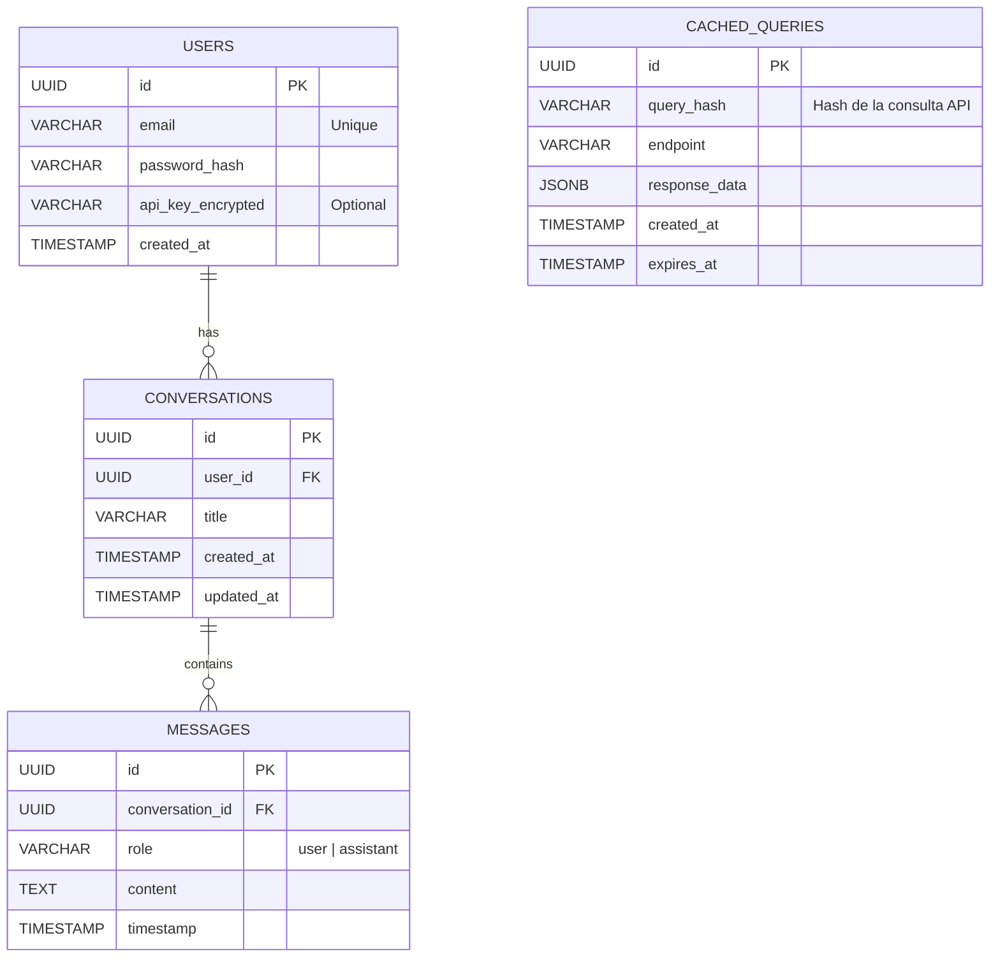

## Índice

0. [Ficha del proyecto](#0-ficha-del-proyecto)
1. [Descripción general del producto](#1-descripción-general-del-producto)
2. [Arquitectura del sistema](#2-arquitectura-del-sistema)
3. [Modelo de datos](#3-modelo-de-datos)
4. [Especificación de la API](#4-especificación-de-la-api)
5. [Historias de usuario](#5-historias-de-usuario)
6. [Tickets de trabajo](#6-tickets-de-trabajo)
7. [Pull requests](#7-pull-requests)

---

## 0. Ficha del proyecto

### **0.1. Tu nombre completo:**

Lester David López Bustillo

### **0.2. Nombre del proyecto:**

**GolMetrics**

### **0.3. Descripción breve del proyecto:**

GolMetrics es un chatbot inteligente especializado en estadísticas de fútbol. Permite a aficionados, periodistas y apostadores consultar datos complejos (goleadores, clasificaciones, históricos) mediante lenguaje natural, democratizando el acceso a la información deportiva avanzada sin necesidad de navegar por tablas complejas.

### **0.4. URL del proyecto:**

> [URL Pública o Privada del Despliegue - Pendiente]

### 0.5. URL o archivo comprimido del repositorio

> [URL del Repositorio GitHub - Pendiente]

---

## 1. Descripción general del producto

### **1.1. Objetivo:**

El propósito de GolMetrics es simplificar el acceso a estadísticas de fútbol detalladas. Actualmente, encontrar datos específicos (ej. "¿Quién fue el máximo goleador de la Premier en 2015?") requiere navegar por múltiples menús y sitios web. GolMetrics soluciona esto mediante una interfaz conversacional (Chatbot) que interpreta la intención del usuario, consulta fuentes de datos fiables (API-Football) y entrega una respuesta directa y formateada, enriquecida con inteligencia artificial.

### **1.2. Características y funcionalidades principales:**

- **Consulta en Lenguaje Natural:** Interpretación de preguntas complejas gracias a IA Generativa (Semantic Kernel + Microsoft.Extensions.AI + Gemini).
- **BYOK (Bring Your Own Key):** Los usuarios pueden configurar su propia API Key de proveedores de datos para evitar límites globales, gestionada de forma segura.
- **Sistema de Caché:** Almacenamiento local de consultas frecuentes en PostgreSQL para reducir latencia y consumo de cuotas de API externas.
- **Historial de Conversaciones:** Persistencia de sesiones de chat para revisar consultas anteriores.
- **Datos en Tiempo Real e Históricos:** Cobertura de las principales ligas europeas desde 2010 hasta la actualidad.
- **Autenticación Segura:** Registro y login de usuarios para proteger historiales y configuraciones personales.

### **1.3. Diseño y experiencia de usuario:**

> _Nota: Pendiente de añadir capturas de pantalla o video del prototipo funcional en la Fase 2._

El flujo de usuario está diseñado para ser minimalista:

1.  **Landing/Login:** Acceso rápido a la cuenta.
2.  **Dashboard/Chat:** Una interfaz limpia centrada en la caja de texto, similar a ChatGPT.

### **1.4. Instrucciones de instalación y ejecución (Entrega 2):**

Este proyecto utiliza Docker para orquestar el Frontend, Backend y Base de Datos.

**Prerrequisitos:**

- Docker Desktop instalado y corriendo.
- Git.

**Pasos para despliegue local:**

1.  **Clonar el repositorio:**

    ```bash
    git clone <url-repo>
    cd GolMetrics
    ```

2.  **Ejecutar con Docker Compose:**
    Este comando construirá las imágenes del Backend (.NET 10) y Frontend (React/Vite/Nginx) y levantará la base de datos.

    ```bash
    docker compose up --build
    ```

3.  **Acceder a la aplicación:**
    - **Frontend (Chat):** [http://localhost:5173](http://localhost:5173)
        - _Prueba:_ Escribe cualquier mensaje y recibirás respuesta del Backend.
    - **API Documentation (Scalar):** [https://localhost:7000/scalar](https://localhost:7000/scalar)
    - **API Swagger JSON:** [https://localhost:7000/openapi/v1.json](https://localhost:7000/openapi/v1.json)

**Notas de la Entrega 2:**

- Se ha implementado un "Walking Skeleton" funcional.
- El Frontend se comunica con el Backend a través de Nginx (Docker) o Proxy (Local).
- El Backend responde con un mensaje de prueba ("Proof of Life") para validar la conexión.

---

## 2. Arquitectura del Sistema

### **2.1. Diagrama de arquitectura:**

```mermaid
graph TD
    subgraph Client [Cliente]
        Browser[Navegador Web / React SPA]
    end

    subgraph Cloud_Infrastructure [Infraestructura & Backend]
        LB[Load Balancer / Reverse Proxy]

        subgraph App_Services [Servicios de Aplicación]
            API[.NET 9 Web API]
            Auth[Auth Service (Identity)]
            AI_Orch[Semantic Kernel Orchestrator]
        end

        subgraph Data_Layer [Capa de Datos]
            DB[(PostgreSQL)]
            Cache[(Redis / PG Cache)]
        end
    end

    subgraph External_Services [Servicios Externos]
        Gemini[Google Gemini API (LLM)]
        FootAPI[API-Football (Data Source)]
    end

    Browser -->|HTTPS/REST| LB
    LB --> API
    API --> Auth
    API --> AI_Orch
    API --> DB

    AI_Orch -->|Prompt/Context| Gemini
    AI_Orch -->|Data Fetch| FootAPI

    API -->|Read/Write| Cache
```

**Stack Tecnológico:**

| Capa          | Tecnología                                         |
| ------------- | -------------------------------------------------- |
| Frontend      | React 18+ + Vite + shadcn/ui + TypeScript          |
| Backend       | .NET 10 (Minimal API)                              |
| Base de Datos | PostgreSQL 16                                      |
| IA/LLM        | Microsoft.Extensions.AI + Semantic Kernel + Gemini |
| ORM           | Entity Framework Core 10                           |
| Autenticación | ASP.NET Core Identity + JWT                        |
| Cache         | PostgreSQL (tabla dedicada)                        |
| Mapeo         | Mapperly (source generator)                        |
| Validación    | FluentValidation                                   |
| CQRS          | MediatR                                            |
| Logging       | Serilog                                            |
| Testing       | xUnit + Bogus (data generation)                    |
| Contenedores  | Docker + Docker Compose                            |
| CI/CD         | GitHub Actions                                     |

**Justificación:**
Se ha elegido una **Arquitectura Vertical Híbrida** que combina los beneficios de Vertical Slice Architecture con elementos de Clean Architecture.

**Estructura del Backend:**

```
/src/GolMetrics.API
├── /Core
│   ├── /Domain          # Entidades base, Value Objects compartidos
│   └── /Application     # Interfaces y abstracciones (IRepository, IFootballApiClient)
├── /Features            # Vertical Slices (todo en un archivo .cs)
│   ├── /Chat
│   │   ├── SendMessage.cs          # Endpoint + Command + Handler + Validator + DTOs
│   │   └── GetConversation.cs
│   ├── /Auth
│   │   ├── Register.cs
│   │   └── Login.cs
│   └── /Football
│       └── GetTopScorers.cs
├── /Infrastructure      # Implementaciones técnicas (DbContext, API Clients, Repositories)
├── /Extensions          # Extension methods para configuración
├── /Middlewares         # Custom middlewares (ErrorHandling, Logging)
└── DependencyInjection.cs
```

**Ventajas de esta arquitectura:**

- **Alta cohesión:** Cada feature tiene toda su lógica en un solo archivo, facilitando navegación y mantenimiento.
- **Bajo acoplamiento:** Features independientes entre sí, comunicación vía MediatR.
- **Escalabilidad:** Fácil agregar nuevas features sin afectar las existentes.
- **Testabilidad:** Cada slice es autónoma y testable de forma aislada.
- **Core compartido:** Domain y Application evitan duplicación de entidades y contratos base.

**Decisiones técnicas clave:**

- **Mapperly vs AutoMapper:** Source generator para mejor performance y type-safety en compile-time.
- **MediatR:** Desacopla endpoints de handlers, facilita testing y permite pipelines de validación.
- **Minimal API:** Reduce boilerplate, ideal para vertical slices compactas.
- **Microsoft.Extensions.AI:** Abstracción agnóstica del proveedor LLM, facilita cambiar entre OpenAI/Azure/Gemini.
- **PostgreSQL para caché:** Evita complejidad de Redis en MVP, aprovechar JSONB para flexibilidad.

### **2.2. Descripción de componentes principales:**

1.  **Frontend (React + Vite):** SPA moderna que gestiona la UI del chat y el estado de la sesión. Utiliza `Axios` para la comunicación con el backend y `shadcn/ui` para el diseño.
2.  **Backend (.NET 10 Web API):** Núcleo del sistema. Expone endpoints REST.
    - Minimal API: Maneja las peticiones HTTP.
    - CQRS: Lógica de negocio.
    - AI Layer (Semantic Kernel): Interpreta el lenguaje natural y decide qué "Plugin" (función) ejecutar (ej: `GetTopScorers`).
3.  **Base de Datos (PostgreSQL):** Almacena usuarios, historiales de chat y una caché relacional de las respuestas de la API de fútbol para optimizar costes.
4.  **Orquestador IA:** Utiliza `Microsoft.Extensions.AI` y `Semantic Kernel` para conectar el input del usuario con las funciones programáticas.

### **2.3. Descripción de alto nivel del proyecto y estructura de ficheros**

La estructura sigue las convenciones de .NET y React:

```
/GolMetrics
├── /src
│   ├── /GolMetrics.API        # Proyecto Web API (.NET 9)
│   └── /GolMetrics.Web        # Frontend (React)
├── /tests                     # Tests unitarios y de integración (xUnit)
├── /docker                    # Configuraciones de Docker
└── /docs                      # Documentación del proyecto
```

### **2.4. Infraestructura y despliegue**

El despliegue se realiza mediante contenedores Docker orquestados por Docker Compose para local y un PaaS (como Render o Heroku) para producción.

- **CI/CD:** GitHub Actions se encargará de ejecutar los tests en cada Pull Request.
- **Entorno:** Contenedor Linux (Alpine) para el backend .NET y servidor estático (Nginx) para el frontend React.

### **2.5. Seguridad**

1.  **JWT (JSON Web Tokens):** Para la autenticación stateless de usuarios.
2.  **Encriptación de Secretos:** Las API Keys personales de los usuarios (API-Football Key) se almacenan encriptadas en la base de datos (AES-256).
3.  **HTTPS:** Comunicación encriptada obligatoria.
4.  **Input Validation:** Validación estricta en el backend para prevenir inyección SQL y XSS.

### **2.6. Tests**

- **Unitarios (xUnit):** Pruebas de la lógica de negocio y parseo de datos.
- **Integración:** Pruebas de los repositorios y la conexión con la base de datos.
- **E2E (Manual/Cypress):** Verificación del flujo completo de chat.

---

## 3. Modelo de Datos

### **3.1. Diagrama del modelo de datos:**



### **3.2. Descripción de entidades principales:**

- **USERS:** Gestiona la identidad. El campo `api_key_encrypted` permite al usuario almacenar su propia clave de API-Football de forma segura.
- **CONVERSATIONS:** Agrupa los mensajes. Representa una sesión de chat completa sobre un tema o serie de preguntas.
- **MESSAGES:** Cada interacción individual. `role` distingue si es el usuario o la IA.
- **CACHED_QUERIES:** Tabla técnica crítica para el rendimiento. Almacena la respuesta cruda (JSON) de la API externa asociada a un hash de los parámetros de consulta. Tiene un `expires_at` para invalidar datos viejos (ej: resultados de partidos en vivo caducan rápido, históricos de 2010 tardan meses).

---

## 4. Especificación de la API

Endpoints principales REST (formato simplificado OpenAPI):

### 1. Chat Completion

- **POST** `/api/chat/message`
- **Descripción:** Envía un mensaje de usuario, procesa la intención con IA y devuelve la respuesta estructurada.
- **Body:** `{ "conversationId": "uuid", "content": "¿Quién es el pichichi de La Liga?" }`
- **Response:** `{ "response": "El máximo goleador es...", "data": { ... } }`

### 2. User Settings (API Key)

- **PUT** `/api/user/settings`
- **Descripción:** Permite al usuario guardar o actualizar su API Key de proveedor de datos.
- **Body:** `{ "footballApiKey": "xxxx-xxxx" }`

### 3. Historial

- **GET** `/api/conversations/{id}`
- **Descripción:** Recupera todo el historial de mensajes de una conversación específica.

---

## 5. Historias de Usuario

> Documentación completa en: [`docs/01-product/UserStories.md`](../docs/01-product/UserStories.md)

**Historia de Usuario 1: Configuración de API Key (BYOK)** - US-004

> "Como usuario avanzado, quiero poder ingresar mi propia clave de API-Football en mi perfil, para poder realizar consultas sin depender de los límites de la cuota gratuita del sistema y aprovechar mi propia suscripción."
>
> - **Criterios de Aceptación:** El campo se guarda encriptado (AES-256). Si la clave es inválida, el sistema avisa. El sistema prioriza usar esta clave sobre la del sistema.

**Historia de Usuario 2: Consultas en Lenguaje Natural (5 tipos Must-Have)** - US-011 a US-015

> "Como aficionado al fútbol, quiero hacer preguntas como 'Goleadores Premier 2024', 'Tabla de La Liga', 'Últimos partidos del Madrid', 'Próximo partido del Barcelona', o 'Stats del Liverpool' y obtener respuestas formateadas."
>
> - **Tipos de consultas soportadas:**
>     1. Máximos goleadores
>     2. Clasificación/Tabla
>     3. Resultados recientes
>     4. Próximos partidos
>     5. Estadísticas de equipo
> - **Criterios de Aceptación:** La IA identifica la intención, extrae entidades (liga, equipo, temporada) y devuelve una tabla Markdown con los datos.

**Historia de Usuario 3: Persistencia de Chat** - US-008, US-009, US-010

> "Como usuario, quiero que mis conversaciones se guarden automáticamente, para poder volver a consultar un dato que pregunté anteriormente."
>
> - **Criterios de Aceptación:** Al entrar al dashboard, veo mi lista de chats anteriores ordenados por fecha. Al clicar uno, se cargan los mensajes previos.

---

## 6. Tickets de Trabajo

> Documentación completa en: [`docs/05-operations/WorkTickets.md`](../docs/05-operations/WorkTickets.md)

**Resumen de Tickets (7 tickets consolidados):**

| Ticket   | Descripción                         | Estimación |
| -------- | ----------------------------------- | ---------- |
| TICK-001 | Setup del Proyecto y Base de Datos  | M (3d)     |
| TICK-002 | Sistema de Autenticación Completo   | M (3d)     |
| TICK-003 | Integración Semantic Kernel/Gemini  | M (3d)     |
| TICK-004 | Endpoint de Chat y Sistema de Caché | L (5d)     |
| TICK-005 | Frontend de Autenticación           | M (2d)     |
| TICK-006 | Frontend de Chat UI                 | L (5d)     |
| TICK-007 | Tests y Despliegue                  | M (4d)     |

**Ticket 1 (TICK-003): Integración con Semantic Kernel y Gemini**

- **Descripción:** Integrar Microsoft.Extensions.AI + Semantic Kernel con Google Gemini para procesamiento de lenguaje natural.
- **Tareas principales:**
    1. Instalar paquetes `Microsoft.SemanticKernel` y `Microsoft.SemanticKernel.Connectors.Google`
    2. Crear `FootballPlugin` con las 5 funciones Must-Have (GetTopScorers, GetStandings, etc.)
    3. Configurar function calling automático basado en intención del usuario

**Ticket 2 (TICK-006): Frontend de Chat UI**

- **Descripción:** Interfaz principal del chatbot con sidebar de conversaciones y área de mensajes.
- **Tareas principales:**
    1. Layout con sidebar (historial) y main area (chat)
    2. Componentes: `ConversationList`, `MessageBubble`, `ChatInput`
    3. Renderizado de Markdown con `react-markdown`
    4. Estados: loading, error, empty

**Ticket 3 (TICK-004): Endpoint de Chat y Sistema de Caché**

- **Descripción:** Endpoint principal de chat con integración de caché en PostgreSQL.
- **Tareas principales:**
    1. `POST /api/chat/message` con MediatR handler
    2. Caché con hash SHA-256 de parámetros
    3. TTL diferenciado: 30d históricos, 1h actuales

---

## 7. Pull Requests

_(Se completará durante la fase de desarrollo)_

**Pull Request 1**

> [Pendiente: Link al PR de Setup Inicial]

**Pull Request 2**

> [Pendiente: Link al PR de Autenticación]

**Pull Request 3**

> [Pendiente: Link al PR de Lógica de Chat]
